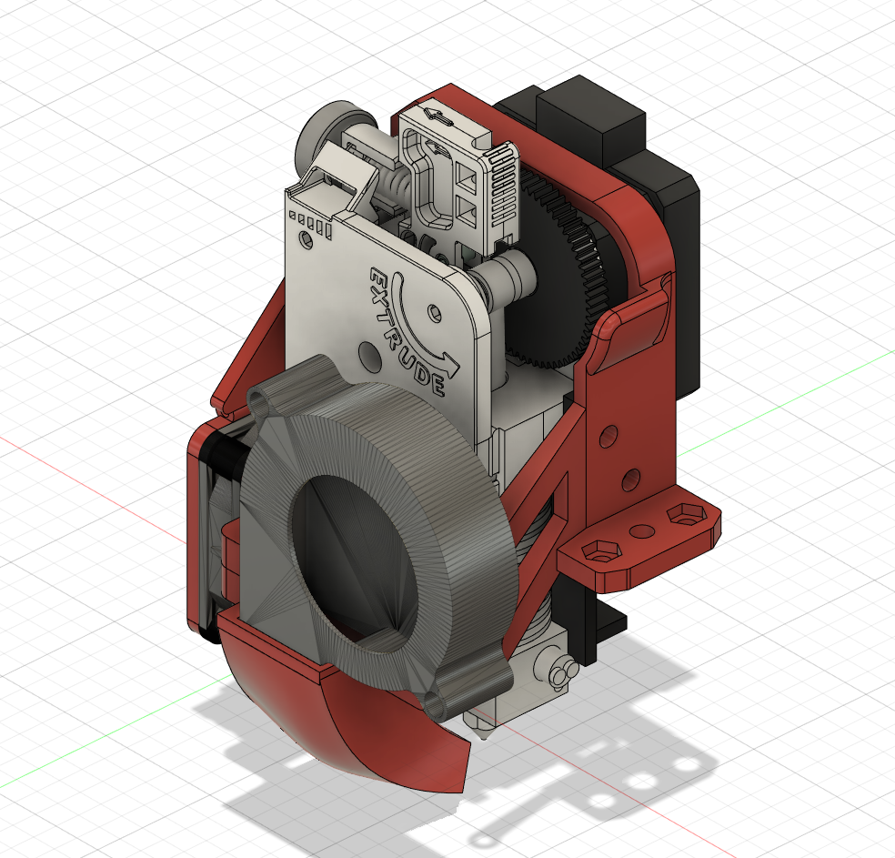
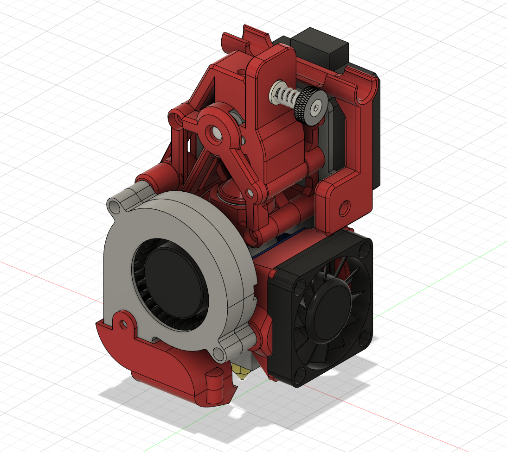
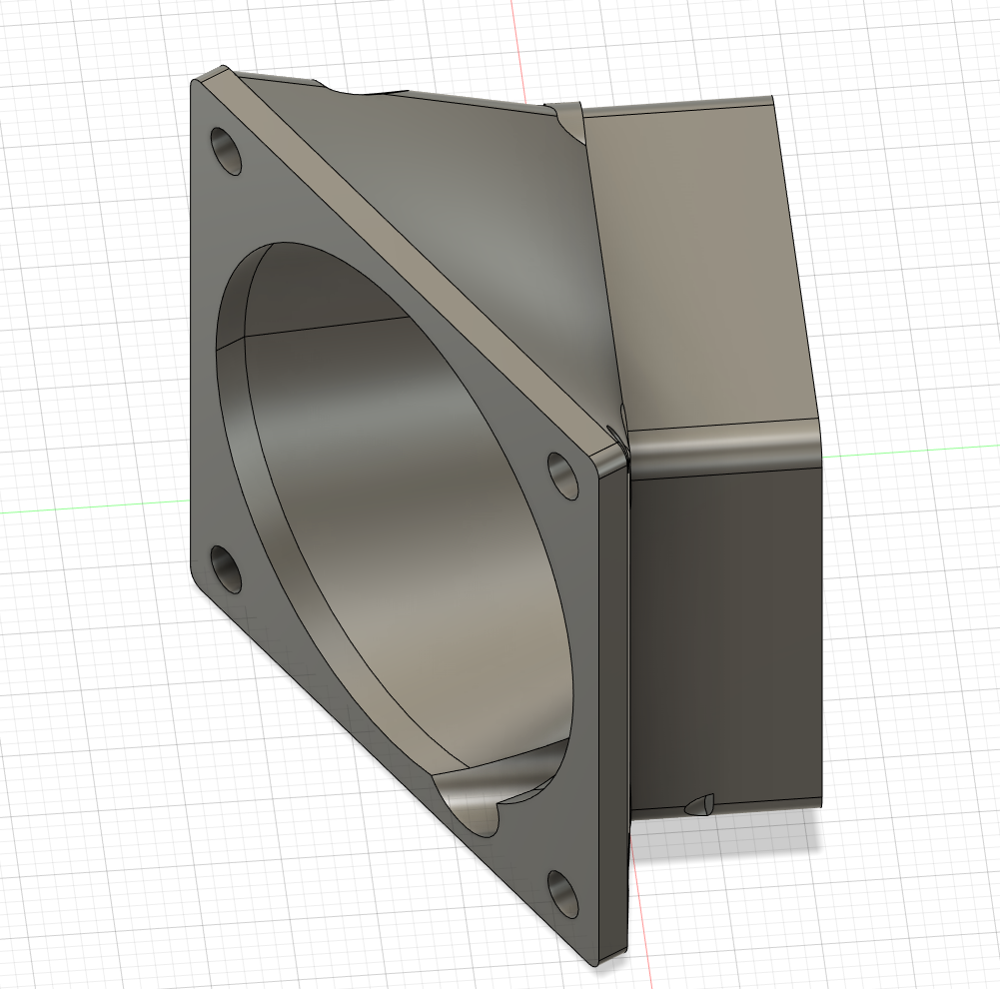
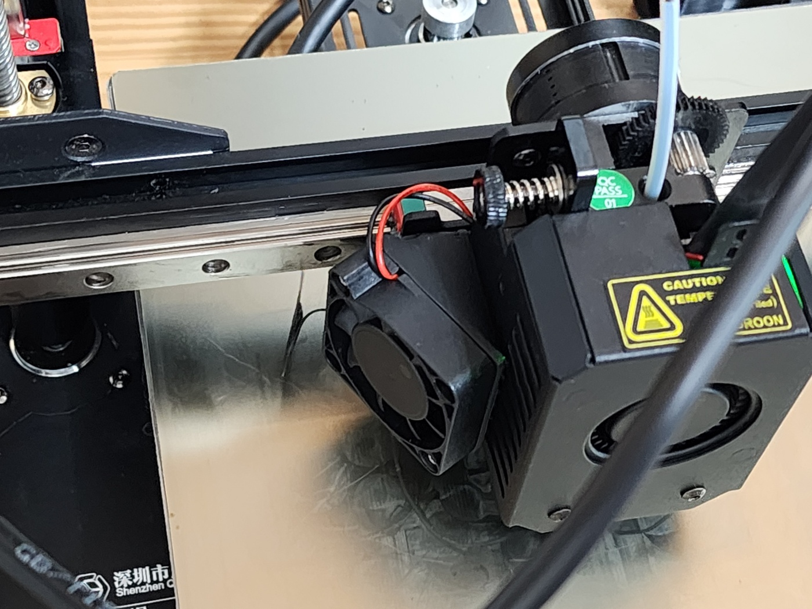

# kINGROON TITAN EXTRUDER COOLER

## 필요한 부품 리스트
* M4
    * 6mm 3개(본체결합용)
* M3 
    * 20mm 5개 (4010,5015 팬 고정용)
    * 너트 2개 (5015팬 고정용)
    * 35mm 1개 (4010<>5015 부속 연결)
* 자석
    3파이 3MM 4개 (덕트고정용)

### 재질
* PLA 가능

### 설계 기준 히팅 시스템
* E3d V5, V6
* 높이가 30mm인 노즐목 사용 기준

### 업데이트
 - 240430-최초업데이트

# BMG Extruder Light Version

## 필요한 부품 리스트

* 본체고정용
    * M4 6mm 3개
* 5015에 부착되는 부품
    * M3 35mm 1개
    * M3용 멜팅너트 2개
    * M3 20mm 1개
* 노즐
    * M3 20mm 1개
    * M3 너트 1개
    * 3파이 3mm 자석4개
* 4010 팬
    * E3D V5,V6용 쿨링 덕트
    * M3 멜팅너트 1개
    * M3 10MM 3개
    * M3 납작머리 8MM 3개
    * M3 25mm 1개

### 재질
* PETG 이상 강도가 나오는 필라멘트 사용

### 설계 기준 히팅 시스템
* E3d V5, V6
* 높이가 30mm인 노즐목 사용 기준

### 업데이트 
 - 240622-필라멘트 가이드 추가
 - 240605-모터 공차 추가
 - 240531-아이들러 개선
 - 240430-최초 업데이트

# kp3s pro v2 쿨러 어댑터

## kp3s pro v2의 쿨러용 어댑터

3010 >> 4010으로 변경 할때  사용합니다.

## 필요한 부품 리스트
* m3 10mm 4개

### 업데이트
 - 240619-최초업데이트

